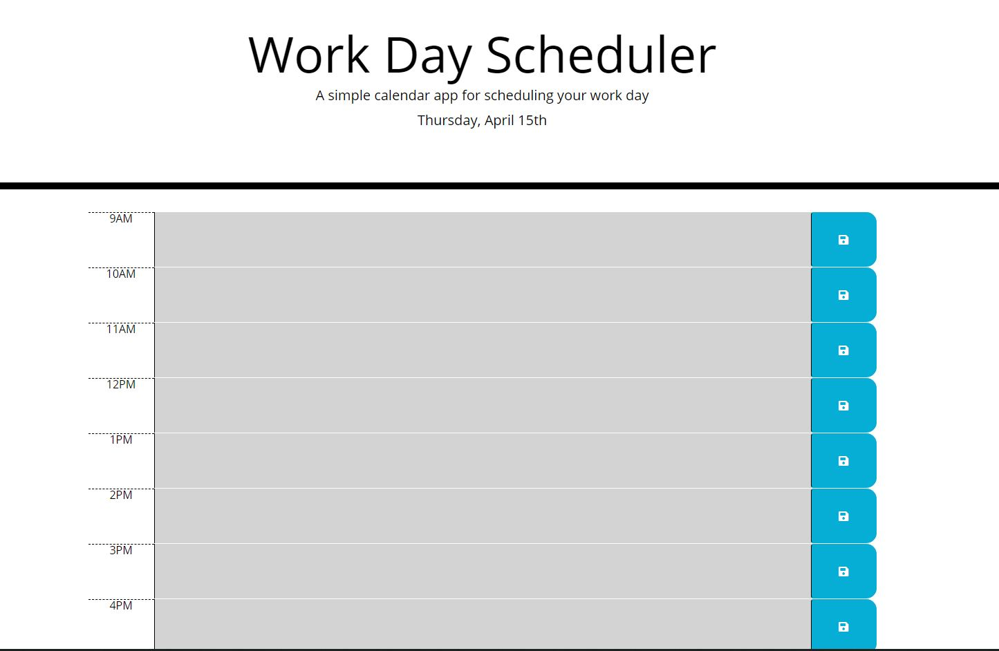

# Work-Day-Scheduler

## Description

I developed a daily planner where you can write down tasks to do depending on the time. The working hours of a day are considered (9 in the morning to 5 in the afternoon). A color criterion is used to classify the hours / tasks that have already passed, those that are in progress and those that are to come. The tasks are saved in Local Storage to be consulted even if the browser is closed.

## Acceptance Criteria

```md
GIVEN I am using a daily planner to create a schedule
WHEN I open the planner
THEN the current day is displayed at the top of the calendar
WHEN I scroll down
THEN I am presented with timeblocks for standard business hours
WHEN I view the timeblocks for that day
THEN each timeblock is color coded to indicate whether it is in the past, present, or future
WHEN I click into a timeblock
THEN I can enter an event
WHEN I click the save button for that timeblock
THEN the text for that event is saved in local storage
WHEN I refresh the page
THEN the saved events persist
```

## Mock Up

URL: https://luiscruz-24.github.io/Work-Day-Scheduler/


